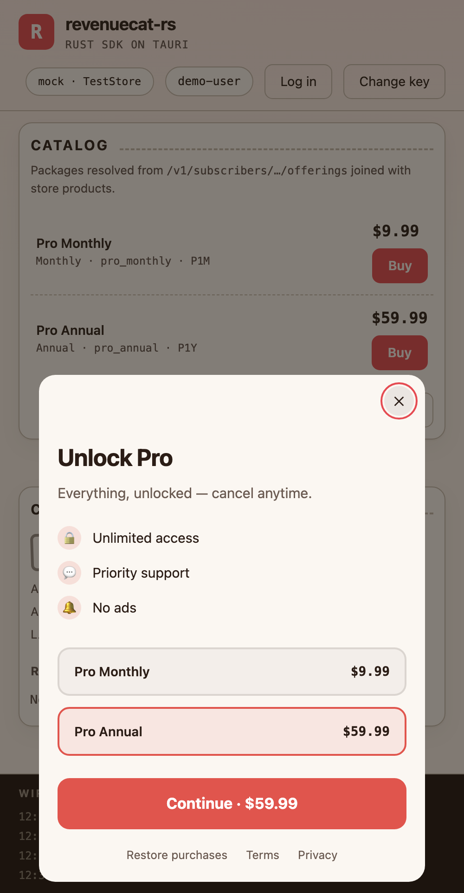
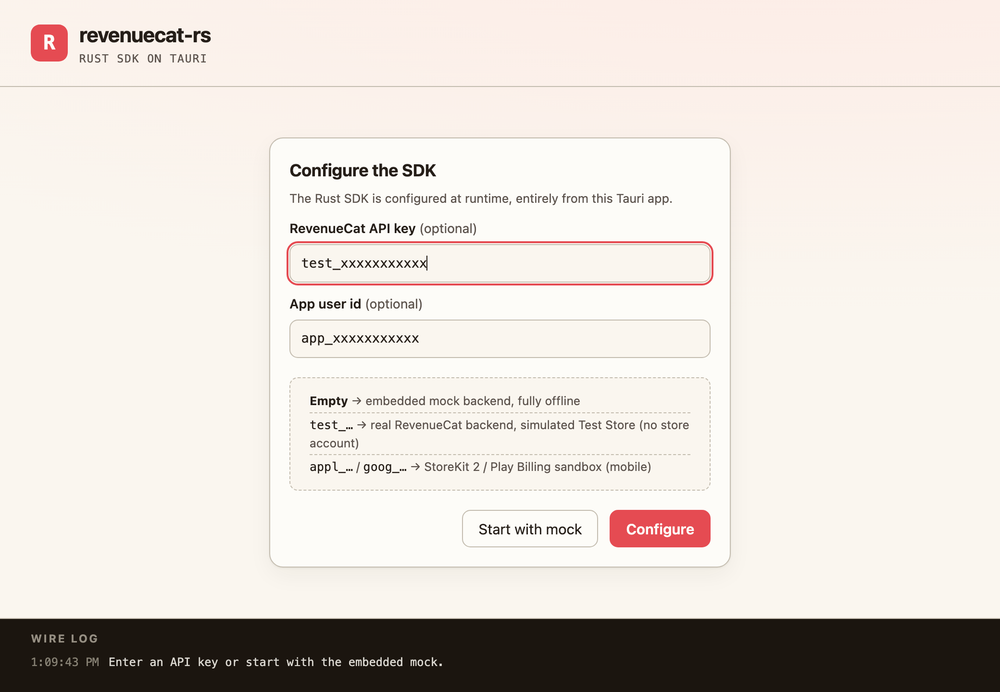

# revenuecat-rs

**RevenueCat SDK for Rust**, protocol-compatible with the official
[purchases-ios], [purchases-android], and [purchases-js] SDKs (all MIT), down
to the same wire formats.

A `test_` (Test Store) key needs **no native store**: purchases are simulated
end to end, so the SDK, its tests, and the Tauri demo all run on desktop and
CI. Real stores plug in through one trait.


```toml
[dependencies]
revenuecat-rs = "1.0"   # imported in code as `revenuecat`
```

## Usage

### In a Tauri app

Two ways to use the SDK in Tauri, both via `tauri-plugin-revenuecat`: a
**TypeScript** track where the plugin owns the SDK and you call it from the
webview, and a **Rust** track where you own the `Purchases` instance. Full
examples of both are in
[Two tracks in a Tauri app](#two-tracks-in-a-tauri-app-typescript-or-rust)
below. Every model and `revenuecat::Error` is `Serialize`, so commands return
them directly with a stable error `code` for the UI.

Test commands headlessly with `tauri::test::mock_builder` + `get_ipc_response`
(see `demo/tauri-app/src-tauri/tests/commands.rs`). The ACL local origin is
`tauri://localhost` on macOS/Linux, `http://tauri.localhost` on Windows.


### Configure

```rust
use revenuecat::{Configuration, Purchases};

// Test Store: real backend, no native store, no store account.
let purchases = Purchases::configure(
    Configuration::builder("test_YOUR_KEY")
        .app_user_id("gon")          // omit for an anonymous $RCAnonymousID:…
        .build()?,
)?;

// Point at a mock / staging host (same idea as `Purchases.proxyURL`).
let staging = Configuration::builder("test_KEY")
    .proxy_url("http://127.0.0.1:8000")
    .build()?;
```

### Offerings and purchases

```rust
let offerings = purchases.get_offerings().await?;
let monthly = offerings.current().and_then(|o| o.monthly()).expect("package");
println!("{}: {}", monthly.store_product.title, monthly.store_product.price.formatted());

// store flow -> POST /v1/receipts -> server-computed CustomerInfo
let result = purchases.purchase_package(monthly).await?;
assert!(result.customer_info.entitlements.is_active("pro"));
```

### Paywalls

The paywall you design in the RevenueCat dashboard rides along on each
offering, so you draw it yourself instead of embedding a native paywall UI.
`Offering.paywall` is the v1 template config (`Paywall`); `paywall_components`
is the v2 component tree. Both are `Serialize`, so a Tauri command can hand the
whole thing to a webview to render as HTML/CSS.

```rust
let offerings = purchases.get_offerings().await?;
if let Some(paywall) = offerings.current().and_then(|o| o.paywall.as_ref()) {
    // Copy resolved for a locale, merged over the config defaults.
    let strings = paywall.strings_for("en_US");
    println!("{}", strings.title.as_deref().unwrap_or_default());

    // Dashboard colors are hex strings; images honor `asset_base_url`.
    let cta = paywall.config.colors.light.call_to_action_background.as_deref();
    if let Some(header) = paywall.web_images().header.as_deref() {
        println!("header: {}", paywall.image_url(header));   // webp preferred
    }

    // The package ids to show, in dashboard order, joined to the offering.
    for id in &paywall.config.packages {
        if let Some(pkg) = offerings.current().and_then(|o| o.package(id)) {
            println!("{}: {}", pkg.store_product.title, pkg.store_product.price.formatted());
        }
    }
}
```

The demo renders this config as a bottom sheet / centered card: header,
title, subtitle, feature list, selectable package cards, and a CTA that buys
the selected package, all in the dashboard's own colors. See
`demo/tauri-app/ui/main.js` (`renderPaywall`) for a complete v1 renderer.



### Customer info and entitlements

```rust
use revenuecat::CacheFetchPolicy;

let info = purchases.get_customer_info(CacheFetchPolicy::default()).await?;
if let Some(pro) = info.entitlements.get("pro") {
    println!("active={} renews={} until={:?}", pro.is_active, pro.will_renew, pro.expiration_date);
}
println!("active subs: {:?}", info.active_subscriptions());
```

### Customer center

RevenueCat's Customer Center is a prebuilt screen in the native SDKs; here it's
data you render (like paywalls). `CustomerInfo` carries what a self-serve
support screen needs: status, renewal, billing issues, and the store's own
manage page.

```rust
let info = purchases.get_customer_info(Default::default()).await?;

// "Manage / cancel subscription" → open the store's management page
// (in Tauri, hand `url` to tauri-plugin-opener).
if let Some(url) = &info.management_url {
    open_url(url);
}

for (product_id, sub) in &info.subscriptions {
    println!("{product_id}: active={} renews={} until={:?}",
        sub.is_active, sub.will_renew, sub.expires_date);
    if sub.billing_issues_detected_at.is_some() { /* show a fix-payment banner */ }
    if sub.unsubscribe_detected_at.is_some() { /* auto-renew off → offer resubscribe */ }
}

let info = purchases.restore_purchases().await?;   // the "Restore purchases" button
```

### Identity and attributes

```rust
let (info, created) = purchases.log_in("gon-pro").await?;   // alias & switch user
purchases.set_email("gon@example.com").await?;              // reserved $email attribute
purchases.set_attributes([("plan_intent".into(), Some("pro".into()))].into()).await?;
purchases.log_out().await?;                                 // back to a fresh anonymous id
```

### Trusted Entitlements (Ed25519 signatures)

Off by default, like the official SDKs.

```rust
use revenuecat::EntitlementVerificationMode;

let config = Configuration::builder("test_KEY")
    // Informational: verify + report. Enforced: failures become errors.
    .entitlement_verification_mode(EntitlementVerificationMode::Informational)
    .build()?;

let info = purchases.get_customer_info(Default::default()).await?;
assert!(info.entitlements.verification.is_verified());
```

Verified endpoints send `X-Nonce`; signed POSTs add `X-Post-Params-Hash`.
Against `revenuecat-mock` (its own test chain) add
`.verification_root_key(revenuecat_mock::test_root_public_key_b64())`.

### Web purchase redemption

```rust
if let Some(link) = Purchases::parse_web_purchase_redemption(&deep_link_url) {
    match purchases.redeem_web_purchase(&link).await? {
        RedeemResult::Success { customer_info } => { /* granted */ }
        RedeemResult::Expired { obfuscated_email } => { /* resend to email */ }
        other => { /* InvalidToken / PurchaseBelongsToOtherUser / Error */ }
    }
}
```

### Virtual currencies and diagnostics

```rust
let balances = purchases.get_virtual_currencies().await?;
println!("gold: {}", balances.balance("GLD"));

// Diagnostics are opt-in; flush batches to the diagnostics host.
let purchases = Purchases::configure(
    Configuration::builder("test_KEY").diagnostics_enabled(true).build()?,
)?;
purchases.flush_diagnostics().await?;
```

### Real stores: the `StoreBilling` trait

Everything above the store is pure logic + HTTP. Implement one trait to plug
in StoreKit / Play Billing and pass it via `ConfigurationBuilder::store_billing`:

```rust
#[async_trait::async_trait]
impl revenuecat::StoreBilling for MyStoreBridge {
    async fn query_products(&self, ids: &[String]) -> revenuecat::Result<Vec<StoreProduct>>;
    async fn purchase(&self, product: &StoreProduct) -> revenuecat::Result<StoreTransaction>;
    async fn query_purchases(&self) -> revenuecat::Result<Vec<StoreTransaction>>;
    async fn finish_transaction(&self, tx: &StoreTransaction, consume: bool) -> revenuecat::Result<()>;
}

let purchases = Purchases::configure(
    Configuration::builder("appl_YOUR_KEY").store_billing(billing).build()?,
)?;
```

`crates/tauri-plugin-revenuecat` implements this over StoreKit 2 (Swift) and
Play Billing (Kotlin) for Tauri mobile apps.

### Two tracks in a Tauri app: TypeScript or Rust

The plugin supports two ways to use RevenueCat. Both register the plugin the
same way; they differ in **who owns the SDK**.

```rust
tauri::Builder::default()
    .plugin(tauri_plugin_revenuecat::init())
    // ... your other setup
```

#### Track 1 — TypeScript (the plugin owns the SDK)

Drive everything from the webview, no per-app Rust glue. Grant the commands in
`src-tauri/capabilities/default.json`:

```json
{ "identifier": "default", "windows": ["main"], "permissions": ["revenuecat:default"] }
```

Then `npm i tauri-plugin-revenuecat` and call the typed wrappers:

```ts
import { configure, getOfferings, purchasePackage } from "tauri-plugin-revenuecat";

// appl_/goog_ keys wire the native store automatically on mobile.
await configure({ apiKey: "test_YOUR_KEY", appUserId: "gon" });

const offerings = await getOfferings();       // typed: Offerings
const pkg = offerings.current?.packages[0];
if (pkg) {
  const result = await purchasePackage(pkg.identifier);
  console.log("pro active:", result.customer_info.entitlements.all.pro?.is_active ?? false);
}
```

Model types (`Offerings`, `CustomerInfo`, `Paywall`, …) ship with the package.
Also: `getCustomerInfo`, `restore`, `logIn`, `logOut`, `setEmail`, `sessionInfo`,
`manageSubscriptions` (the store's manage/cancel URL).

Subscribe to customer-info changes (purchase, restore, refresh) — the
`updatedCustomerInfoListener` equivalent:

```ts
import { onCustomerInfoUpdated } from "tauri-plugin-revenuecat";

const unlisten = await onCustomerInfoUpdated((info) => {
  setPro(info.entitlements.all.pro?.is_active ?? false);
});
```

#### Track 2 — Rust (you own the SDK)

Keep the SDK logic in Rust and expose your own commands; the plugin supplies the
native store on mobile via `store_billing`.

```rust
.setup(|app| {
    let mut builder = revenuecat::Configuration::builder("appl_or_test_KEY");
    // Native store on mobile; Err on desktop (a `test_` key needs no store).
    if let Ok(billing) = tauri_plugin_revenuecat::store_billing(app.handle()) {
        builder = builder.store_billing(billing);
    }
    app.manage(revenuecat::Purchases::configure(builder.build()?)?);
    Ok(())
})

#[tauri::command]
async fn buy(
    purchases: tauri::State<'_, revenuecat::Purchases>,
    package_id: String,
) -> Result<revenuecat::PurchaseResult, revenuecat::Error> {
    let purchases = purchases.inner().clone(); // Purchases is Clone (Arc-backed)
    let offerings = purchases.get_offerings().await?;
    let pkg = offerings.current().and_then(|o| o.package(&package_id)).unwrap();
    purchases.purchase_package(pkg).await
}
```

Same crate, two faces: `revenuecat-rs` (the crate) stays pure Rust; the plugin
adds the TypeScript track on top.

## Workspace

| Crate | What it is |
|---|---|
| `crates/revenuecat` | The SDK: models, HTTP client, backend ops, `Purchases` facade, `StoreBilling` trait + simulated Test Store |
| `crates/revenuecat-mock` | In-process mock of the RevenueCat API (axum), signs responses with a test Ed25519 chain |
| `crates/tauri-plugin-revenuecat` | Tauri 2 plugin: StoreKit 2 / Play Billing behind `StoreBilling`, plus SDK-over-IPC commands + a typed JS/TS package (`tauri-plugin-revenuecat` on npm) |
| `demo/tauri-app` | Tauri 2 demo, configured at runtime from a key input |

## Demo

```sh
cargo run -p revenuecat-tauri-demo
```



Enter an API key on the setup screen to pick the backend:

- **empty** → embedded mock backend, fully offline;
- `test_…` → real RevenueCat backend, simulated Test Store (no store account);
- `appl_…` / `goog_…` → StoreKit 2 / Play Billing (mobile only).

**Show paywall** renders the dashboard paywall from `Offering.paywall` in the
webview and buys the selected package, the same config a native SDK would draw.

There's also a CLI walkthrough of the same flow:

```sh
cargo run -p revenuecat-rs --example test_store_flow
```

## Testing

```sh
cargo test --workspace          # unit + integration + Tauri IPC (115+ tests)
cargo clippy --workspace --all-targets   # unwrap is denied in lib code
cargo deny check                # advisories / licenses
```

The integration suite runs the real SDK stack against `revenuecat-mock` and
asserts exact wire behavior: request paths, headers, receipt-body fields,
ETag 304 replay, and full Ed25519 verification.

**Device-verified:** the Tauri demo has been run on a physical **iPhone 16
(iOS)** and **Galaxy S23 (Android)**, each completing a purchase end to end
against the real RevenueCat **Test Store** backend (`test_` SDK key). The
crate itself is platform-agnostic Rust HTTP; the device runs confirm it works
in the mobile runtime (TLS via bundled webpki roots, no platform-verifier JNI
dependency). Native-store (StoreKit 2 / Play Billing) sandbox purchases still
need paid store accounts.

## Supported platforms & requirements

Native in-app-purchase APIs are gated two ways: by **OS version** (StoreKit 2
needs iOS 15+) and by **store-tooling version** (Google mandates a minimum Play
Billing Library for submissions). What you can run depends on which layer you
use.

**SDK core (`revenuecat-rs`)**: pure Rust HTTP, no platform APIs. Runs
anywhere Rust does: desktop (macOS/Linux/Windows), servers/CI, and inside a
Tauri mobile app.

| | Requirement |
|---|---|
| Rust | **1.90+** (edition 2021) |
| TLS | bundled webpki roots via rustls; no OpenSSL, no Android platform-verifier/JNI |
| Store account | **none** with a `test_` key (simulated Test Store); desktop + CI included |

**Native store bridge (`tauri-plugin-revenuecat`)**: only for real StoreKit 2 /
Play Billing purchases (`appl_`/`goog_` keys, mobile). The OS
floors here match Apple's and Google's own:

| Platform | Floor | Why |
|---|---|---|
| iOS / iPadOS | **15.0+** | StoreKit 2 (Swift-concurrency IAP); the plugin is `@available(iOS 15, *)` and rejects older with a clear error |
| macOS | **12.0+** | StoreKit 2 shipped with the iOS-15 generation |
| Android | **API 24+ (7.0)** | plugin `minSdk = 24`, Play Billing; Google requires Billing Library **v7+** for new Play submissions (deadline 2026-08-31) |
| Tauri | **2.x** | mobile runtime + IPC |

**Verified in CI** (compile checks, self-hosted macOS ARM64 runner):
`aarch64-apple-ios` (+ simulator) and `aarch64-linux-android`.
**Device-verified:** iPhone 16 (iOS) and Galaxy S23 (Android) each completed a
purchase end to end against the real Test Store backend.

## Protocol coverage

| Endpoint | Status |
|---|---|
| `GET /v1/subscribers/{id}` | ✅ custom ETag caching |
| `POST /v1/receipts` | ✅ android-shape body, 429 retry w/ backoff |
| `GET /v1/subscribers/{id}/offerings` | ✅ packages + dashboard paywall |
| `GET /rcbilling/v1/subscribers/{id}/products` | ✅ Test Store products; device-verified on iOS + Android |
| `POST /v1/subscribers/identify` | ✅ created = HTTP 201 |
| `POST /v1/subscribers/{id}/attributes` | ✅ incl. `attribute_errors` |
| `GET /v1/subscribers/{id}/virtual_currencies` | ✅ cache + invalidation |
| Trusted Entitlements (`X-Signature`, Ed25519) | ✅ root → intermediate → payload; nonce + params-hash; 3 modes |
| `POST /v1/subscribers/redeem_purchase` | ✅ typed results + deep-link parser |
| `POST /v1/diagnostics` | ✅ opt-in; Android entry shape and retry semantics |
| Paywalls (`paywall` + `paywall_components` on offerings) | ✅ v1 templates fully typed; v2 components as raw JSON; render in your webview (the demo does) |

Speaks the documented surface plus the endpoints the official MIT-licensed
clients use.

## Migration

Coming from an official SDK (`PurchaserInfo` → `CustomerInfo`, singleton →
instance), from raw REST calls, or upgrading across a `0.x` breaking change?
See the [migration guide](docs/MIGRATION.md).

## License

[MIT](LICENSE).

[purchases-ios]: https://github.com/RevenueCat/purchases-ios
[purchases-android]: https://github.com/RevenueCat/purchases-android
[purchases-js]: https://github.com/RevenueCat/purchases-js
