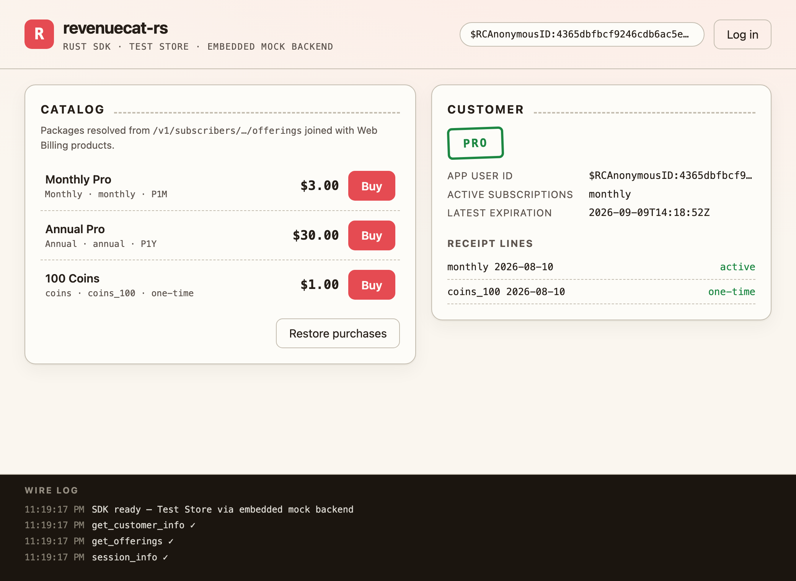

# revenuecat-rs

Unofficial **RevenueCat SDK for Rust**, protocol-compatible with the official
[purchases-ios], [purchases-android], and [purchases-js] SDKs (all MIT). The
wire contract — endpoints, headers, the custom ETag protocol, backend error
codes, and the `POST /v1/receipts` body — was extracted from those SDKs'
sources and test fixtures, not guessed.

With a `test_` (Test Store) API key the SDK needs **no native store at all**:
purchases are simulated end-to-end, which makes desktop and CI testing — and
the included Tauri demo — possible.



*The demo UI fed by real `revenuecat` crate responses (offerings → purchase →
`pro` entitlement active), captured headlessly against the bundled mock
backend.*

## Workspace layout

| Crate | What it is |
|---|---|
| `crates/revenuecat` | The SDK: models, HTTP client, backend ops, `Purchases` facade, `StoreBilling` trait + simulated Test Store |
| `crates/revenuecat-mock` | In-process mock of the RevenueCat API (axum) used by tests and the demo — signs responses with a test Ed25519 chain |
| `crates/tauri-plugin-revenuecat` | Tauri 2 mobile plugin: StoreKit 2 (Swift) / Play Billing (Kotlin) shims behind the `StoreBilling` trait — code-complete, device E2E pending |
| `demo/tauri-app` | Tauri 2 desktop demo driving the SDK through IPC commands |

## How to: use the SDK

```toml
[dependencies]
revenuecat-rs = "0.1"   # imported in code as `revenuecat`
tokio = { version = "1", features = ["macros", "rt-multi-thread"] }
```

```rust
use revenuecat::{CacheFetchPolicy, Configuration, Purchases};

#[tokio::main]
async fn main() -> revenuecat::Result<()> {
    // A `test_` key selects the built-in simulated Test Store.
    let purchases = Purchases::configure(
        Configuration::builder("test_YOUR_KEY")
            .app_user_id("gon")           // omit for an anonymous $RCAnonymousID:…
            .build()?,
    )?;

    // 1. Offerings (backend JSON joined with store products, like the SDKs).
    let offerings = purchases.get_offerings().await?;
    let monthly = offerings.current().and_then(|o| o.monthly()).expect("package");
    println!("{} — {}", monthly.store_product.title, monthly.store_product.price.formatted());

    // 2. Purchase: store flow -> POST /v1/receipts -> server-computed CustomerInfo.
    let result = purchases.purchase_package(monthly).await?;
    assert!(result.customer_info.entitlements.is_active("pro"));

    // 3. Customer info with SDK-style cache policies.
    let info = purchases.get_customer_info(CacheFetchPolicy::default()).await?;
    println!("active: {:?}", info.active_subscriptions());

    // 4. Identity & attributes.
    let (_info, created) = purchases.log_in("gon-pro").await?;
    println!("created new subscriber: {created}");
    purchases.set_email("gon@example.com").await?;
    Ok(())
}
```

Point the SDK anywhere (staging, the bundled mock) with
`.proxy_url("http://127.0.0.1:PORT")` — same semantics as `Purchases.proxyURL`
in the official SDKs.

## How to: verify responses (Trusted Entitlements)

Response-signature verification (Ed25519) is off by default, mirroring the
official SDKs:

```rust
use revenuecat::EntitlementVerificationMode;

let config = Configuration::builder("test_KEY")
    // Informational: verify + report, never block. Enforced: failures
    // become SignatureVerificationError.
    .entitlement_verification_mode(EntitlementVerificationMode::Informational)
    .build()?;
// ...
let info = purchases.get_customer_info(Default::default()).await?;
assert!(info.entitlements.verification.is_verified());
```

Verified endpoints send `X-Nonce` (12 random bytes) and signed POSTs add
`X-Post-Params-Hash`; responses are checked against RevenueCat's root key —
root signature over the intermediate key (with expiry), then the payload
signature over `salt‖api_key‖nonce‖path‖params_hash‖request_time‖etag‖body`.
Against `revenuecat-mock` (which signs with its own test chain) pass
`.verification_root_key(revenuecat_mock::test_root_public_key_b64())`.
Redeem web-purchase deep links with
`Purchases::parse_web_purchase_redemption(url)` +
`purchases.redeem_web_purchase(&r)`.

## How to: run the tests

```sh
cargo test --workspace          # unit + integration + Tauri IPC tests
cargo clippy --workspace --all-targets   # lint gate (unwrap is denied in lib code)
cargo fmt --all --check
cargo deny check                # dependency advisories / licenses (cargo install cargo-deny)
```

The integration suite (`crates/revenuecat/tests/integration.rs`) runs the real
SDK stack against `revenuecat-mock` and asserts **exact wire behavior** —
request paths, `Authorization`/`X-Platform-*` headers, receipt-body fields,
ETag 304 replay — mirroring how purchases-js tests against MSW request spies.

## How to: run the end-to-end example

```sh
cargo run -p revenuecat --example test_store_flow
```

```text
mock backend      http://127.0.0.1:55653
app user id       $RCAnonymousID:4365dbfbcf9246cdb6ac5e5f119d48da
offering          default (3 packages)
  $rc_monthly  monthly      $3.00
  $rc_annual   annual       $30.00
  coins        coins_100    $1.00
purchase          token=test_1786371532643_392182fe-…
entitlement pro   active=true
subscriptions     {"monthly"}
one-time          1 transaction(s)
```

## How to: run the Tauri demo

```sh
cargo run -p revenuecat-tauri-demo
```

That's it — no Node, no bundler, no account. On startup the app:

1. spawns `revenuecat-mock` on an ephemeral port **inside the process**,
2. configures the SDK with a `test_` key + `proxy_url` to that mock,
3. serves a static HTML/CSS/JS frontend that drives everything over Tauri IPC.

Buy the monthly package and watch the `PRO` stamp flip, receipt lines appear,
and the wire log stream each SDK call. To run against the **real** RevenueCat
backend instead, create a Test Store app in the RevenueCat dashboard and in
`demo/tauri-app/src-tauri/src/lib.rs` use your `test_…` key and delete the
`proxy_url` line (and the mock spawn).

Tauri IPC tests run headlessly on the mock runtime:

```sh
cargo test -p revenuecat-tauri-demo
```

## Tauri integration guide

What we learned wiring this SDK into Tauri 2 — apply it to your own app.

### Architecture

```text
webview (JS)  ──invoke()──▶  #[tauri::command]  ──▶  Purchases (revenuecat crate)
                                     │                    │ HTTP (reqwest)
                              managed State           api.revenuecat.com
                                                      (or proxy_url → mock)
```

The SDK is instance-based (no global singleton): configure once in `setup`,
put it in managed state, and every command borrows it.

```rust
pub struct AppState { purchases: revenuecat::Purchases }

tauri::Builder::default()
    .setup(|app| {
        let purchases = revenuecat::Purchases::configure(/* … */)?;
        tauri::Manager::manage(app, AppState { purchases });
        Ok(())
    })
    .invoke_handler(tauri::generate_handler![get_offerings, purchase /*, …*/])
```

### Commands

Every SDK model and `revenuecat::Error` implement `serde::Serialize`, so
commands can return them directly and the frontend receives typed JSON —
including the stable `code` (e.g. `"PurchaseCancelledError"`) for error UI:

```rust
#[tauri::command]
async fn purchase(
    state: tauri::State<'_, AppState>,
    package_id: String,
) -> Result<revenuecat::PurchaseResult, revenuecat::Error> { /* … */ }
```

Note that Tauri converts JS `packageId` ⇄ Rust `package_id` automatically.

### Testing Tauri commands without a window

`tauri::test::mock_builder` + `get_ipc_response` exercise the real invoke
pipeline (serialization, ACL, async commands) headlessly — see
`demo/tauri-app/src-tauri/tests/commands.rs`. Two gotchas we hit:

- **ACL origin**: the local-origin URL is `tauri://localhost` on macOS/Linux
  but `http://tauri.localhost` on Windows. Using the wrong one makes the
  Tauri v2 ACL reject every command with `… not allowed. Plugin not found`.
- Commands invoked via `InvokeRequest` take **camelCase** argument keys,
  exactly like the webview.

### Real stores (beyond the Test Store)

The SDK's store seam is one trait — implement it and pass it via
`ConfigurationBuilder::store_billing`:

```rust
#[async_trait::async_trait]
impl revenuecat::StoreBilling for MyStoreBridge {
    async fn query_products(&self, ids: &[String]) -> revenuecat::Result<Vec<StoreProduct>>;
    async fn purchase(&self, product: &StoreProduct) -> revenuecat::Result<StoreTransaction>;
    async fn query_purchases(&self) -> revenuecat::Result<Vec<StoreTransaction>>;
    async fn finish_transaction(&self, tx: &StoreTransaction, consume: bool) -> revenuecat::Result<()>;
}
```

Platform notes (from surveying how RevenueCat's own hybrid SDKs work):

- **iOS / Android (Tauri mobile)**: use the in-repo
  `crates/tauri-plugin-revenuecat` — Swift (StoreKit 2) and Kotlin
  (Play Billing v8) shims behind `StoreBilling`, registered with
  `.plugin(tauri_plugin_revenuecat::init())` and wired via
  `tauri_plugin_revenuecat::store_billing(app.handle())`. The native code is
  modeled on the official SDKs' wrappers but still needs store accounts and
  devices for end-to-end verification. Remember: after `POST /v1/receipts`
  succeeds, Google purchases must still be **acknowledged within 3 days**
  (`finish_transaction`), or they auto-refund.
- **macOS**: StoreKit works in Mac App Store builds of Tauri apps
  (sandbox + signing required); direct-distribution builds should use web
  checkout instead.
- **Windows / Linux**: RevenueCat has no store integration for these
  platforms (no `X-Platform` value for the Microsoft Store). Use RevenueCat
  Web Billing / Stripe / Paddle web checkout plus Web Purchase Redemption to
  attach purchases to the app user.

### Provenance

Protocol details were extracted from the MIT-licensed official SDKs:
[purchases-ios] (`Sources/Networking`), [purchases-android]
(`common/networking`, `Backend.kt`, `SimulatedStoreBillingWrapper.kt`), and
[purchases-js] (`src/networking`, whose Simulated Store flow this crate's
Test Store follows). This project is not affiliated with RevenueCat; only the
documented surface (`POST /v1/receipts`, `GET /v1/subscribers/…`) plus the
endpoints the official clients use is spoken.

## Protocol coverage

| Endpoint | Status |
|---|---|
| `GET /v1/subscribers/{id}` | ✅ incl. custom ETag caching |
| `POST /v1/receipts` | ✅ android-shape body, 429 retry w/ backoff |
| `GET /v1/subscribers/{id}/offerings` | ✅ |
| `GET /rcbilling/v1/subscribers/{id}/products` | ✅ (Test Store products) |
| `POST /v1/subscribers/identify` | ✅ created = HTTP 201 |
| `POST /v1/subscribers/{id}/attributes` | ✅ incl. `attribute_errors` parsing |
| `GET /v1/subscribers/{id}/virtual_currencies` | ✅ with cache + invalidation |
| Trusted Entitlements (`X-Signature`, Ed25519) | ✅ full chain: root → intermediate (expiry-checked) → payload; nonce + post-params-hash on signed requests; Disabled/Informational/Enforced modes |
| `POST /v1/subscribers/redeem_purchase` | ✅ typed results incl. `Expired { obfuscated_email }`; deep-link parser |
| `POST /v1/diagnostics` (dedicated host) | ✅ opt-in; Android entry shape, 200/batch, 3-retry-then-clear semantics |
| Native stores (StoreKit 2 / Play Billing) | 🔶 `tauri-plugin-revenuecat` shims are code-complete; device E2E pending |
| Paywalls / customer center UI | ❌ out of scope (ships separately in official SDKs too) |

## License

[MIT](LICENSE).

[purchases-ios]: https://github.com/RevenueCat/purchases-ios
[purchases-android]: https://github.com/RevenueCat/purchases-android
[purchases-js]: https://github.com/RevenueCat/purchases-js
